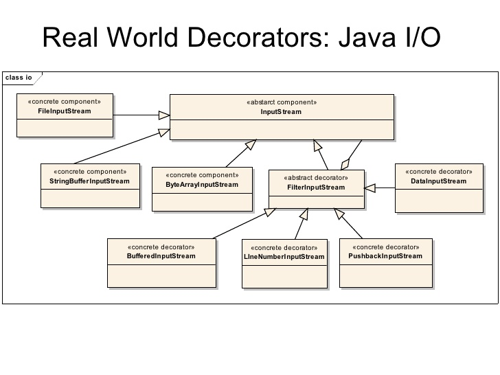

참고 : 자바의 정석 + 수업내용

## 1. 입출력

#### 1.1 입출력이란?

I/O란 Input과 Ouput의 약자로 입력과 출력, 간단히 줄여서 입출력이라고 한다. 입출력은 컴퓨터 내부 또는 외부의 장치와 프로그램간의 데이터를 주고받는 것을 말한다. 예를 들면 키보드로부터 데이터를 입력받는다던가 Sysyem.out.println()을 이용해서 화면에 출력한다던가 하는 것이 가장 기본적인 입출력의 예이다.

#### 1.2 스트림

스트림이란 데이터를 운반하는데 사용되는 연결통로이다. (물을 마시는 빨대)

스트림은 단방향통신만 가능하기 때문에 하나의 스트림으로 입력과 출력을 동시에 처리할 수 업성서 입력스트림(inputSream)과 출력스트림(outputStream) 2개의 스트림이 필요하다.

## 2. 스트림의 종류

스트림은 바이트 단위로 처리하느냐, 문자 단위로 처리하느냐에 따라서 크게 두가지로 나눌 수 있다.

#### 2.1 바이트기반 스트림

- InputStream
- OutputStream

#### 2.2 문자기반 스트림 (char단위 - 2바이트)

- Reader
- Writer

#### * 특수한 IO  (항상 오픈되어 있다.)

- System.out   표준 출력  static한 필드

- System.err  표준 에러 출력

- Syetem.in 표준 입력

## 3. 데코레이터 패턴 (보조스트림)

언급한 스트림 외에도 스트림의 기능을 보완하기 위한 보조스트림이 제공된다. 실제 데이터를 주고받는 스트림이 아니기 때문에 데이터를 입출력할 수 있는 기능은 없지만, 스트림의 기능을 향상시키거나 새로운 기능을 추가할 수 있다. 그래서 보조스트림만으로는 입출력을 처리할 수 없고, 스트림을 먼저 생성한 다음에 이를 이용해서 보조스트림을 생성해야한다.

- 주인공(장식을 할 대상)이 항상 있다. 
- 주인공은 1바이트or배열단위로 읽음. (OutputStream, Reader, Writer)
- 어디에서 읽을 것인가? 주인공이 처리.
- 분별은 어떻게 ? 장식은 생성자에 InputStream을 가지니까 이걸로 분별한다.

- 겹쳐서 여러번 장식이 가능하다.

- 장식은 다양한 메소드가 있고 주인공과 장식을 잘 섞어서 사용해야 한다.

